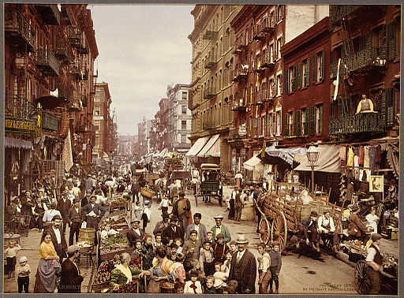

# Fotochrom

The Fotochrom charting library.



## Usage

### As A Script Library

```html
<script src="./dist/fotochrom.js"></script>
```

### As A CommonJS Module

```shell
npm install --save fotochrom
```

and then:

```javascript
const fc = require('fotochrom');
```

### As A Web Component

```shell
bower install --save markbirbeck/fotochrom
```

and then:

```html
<link rel="import" href="../../fotochrom/fotochrom.html">
```
